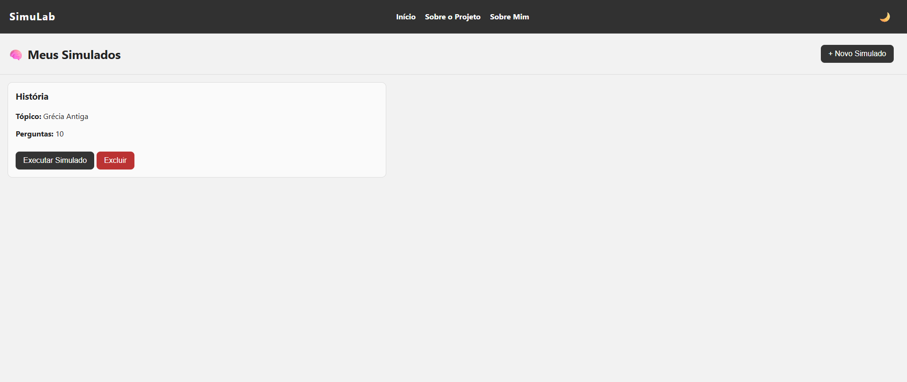
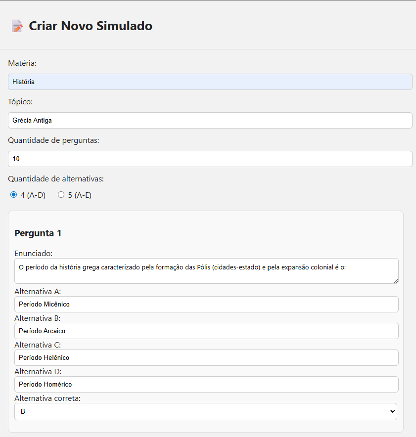
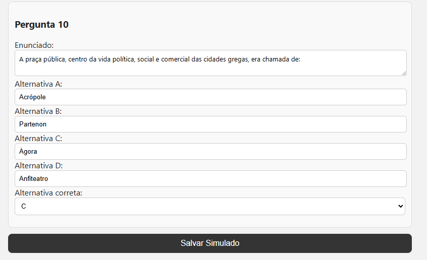
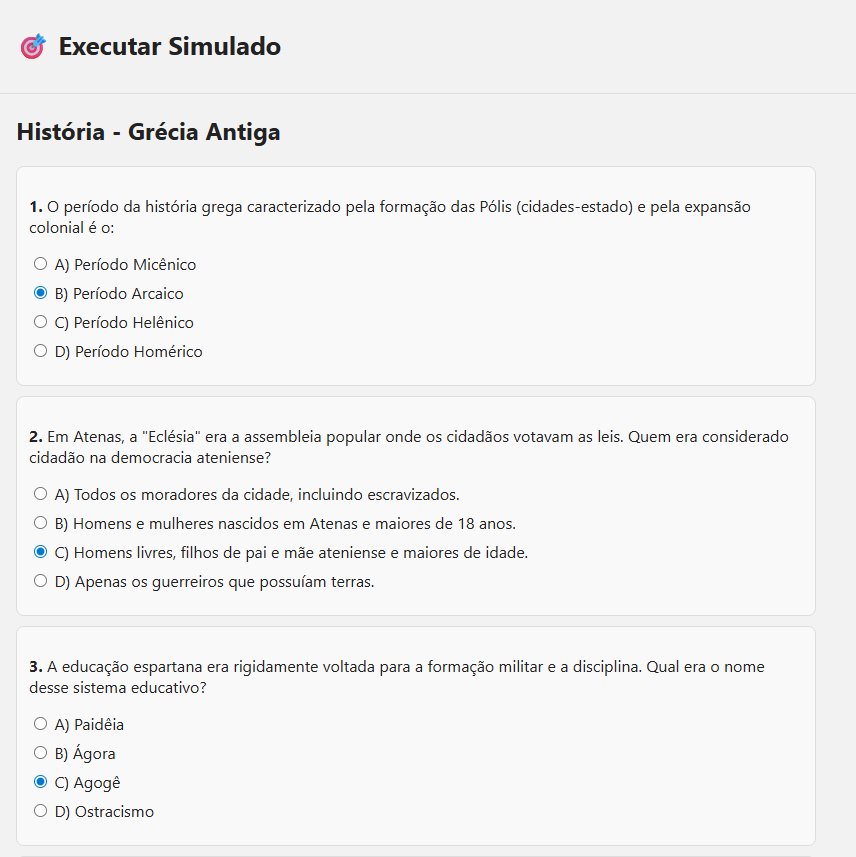
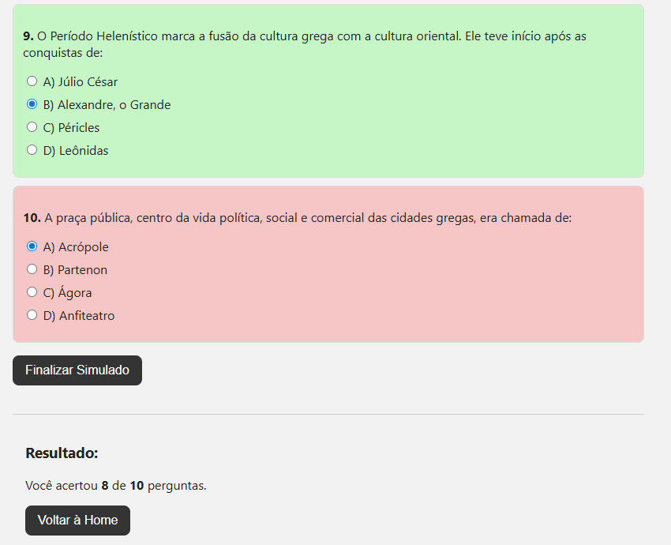

# 🧠📚 SimuLab


---

## 📌 Sobre o Projeto

O **SimuLab** é uma aplicação web desenvolvida com o objetivo de auxiliar estudantes na fixação de conteúdo por meio da criação e execução de simulados personalizados.

O projeto permite:

- Criar simulados por matéria e tópico
- Definir quantidade de perguntas
- Definir número de alternativas (A-D ou A-E)
- Executar o simulado
- Visualizar o resultado final
- Excluir simulados criados

O foco principal é proporcionar uma ferramenta simples, funcional e intuitiva para estudo ativo.

---

## 🚀 Tecnologias Utilizadas

- **HTML5**
- **CSS3**
- **JavaScript**
- Manipulação de DOM
- Armazenamento local (LocalStorage)

---

## 🧩 Funcionalidades

✔ Criar novo simulado  
✔ Definir matéria e tópico  
✔ Definir número de questões  
✔ Escolher quantidade de alternativas  
✔ Executar simulado  
✔ Exibir resultado final  
✔ Interface com modo escuro 🌙  
✔ Exclusão de simulados  

---

# 🕒 Timeline do Projeto

Abaixo está a evolução visual do sistema:

---

## 🏠 1️⃣ Tela Inicial – Meus Simulados

Lista de simulados criados, com opção para executar ou excluir.



---

## ➕ 2️⃣ Criar Novo Simulado

Tela para configurar matéria, tópico, quantidade de questões e alternativas.



---

## 📝 3️⃣ Cadastro das Perguntas

Cadastro detalhado das questões com definição da alternativa correta.



---

## 🎯 4️⃣ Executar Simulado

Interface para responder às perguntas.



---

## 📊 5️⃣ Resultado Final

Exibição da quantidade de acertos após finalizar o simulado.



---

## 🎯 Objetivo do Projeto

Este projeto foi desenvolvido para:

- Fixar conceitos de JavaScript na prática
- Trabalhar manipulação de dados dinâmicos
- Desenvolver lógica de correção automática
- Simular uma aplicação real de estudo
- Evoluir habilidades em desenvolvimento front-end

---

## 🔮 Futuras Atualizações

Em versões futuras do projeto, será implementado:

- 🔁 **Integração com React**
- Componentização da interface
- Organização em arquitetura escalável
- Separação de responsabilidades (componentes, serviços, estado)
- Melhor experiência de usuário
- Possível integração com backend

O objetivo é transformar o SimuLab em uma aplicação moderna utilizando **React.js**, aplicando boas práticas como componentização, gerenciamento de estado e organização profissional de projeto.

---

## 📂 Como Executar o Projeto

1. Clone o repositório:

```bash
git clone https://github.com/gustavocsantos-dev/simulab.git
```

2. Acesse a pasta do projeto:

```bash
cd simulab
```

3. Abra o arquivo principal:

- Localize o arquivo index.html na pasta raiz.

- Dê um duplo clique no arquivo ou arraste-o para dentro do seu navegador de preferência (Chrome, Firefox, Edge, etc.).

---
 ## 👨🏻‍💻 Contribuições

Contribuições são bem-vindas!
Se você quiser colaborar, siga estes passos:

- Faça um fork

- Crie uma feature branch (git checkout -b feature/nome)

- Faça commit das suas mudanças (git commit -m "Descrição do que foi feito")

- Faça push para sua branch (git push origin feature/nome)

- Abra um Pull Request

## 🤝 Autor

Desenvolvido por Gustavo Carvalho dos Santos

🔗 GitHub: https://github.com/gustavocsantos-dev

